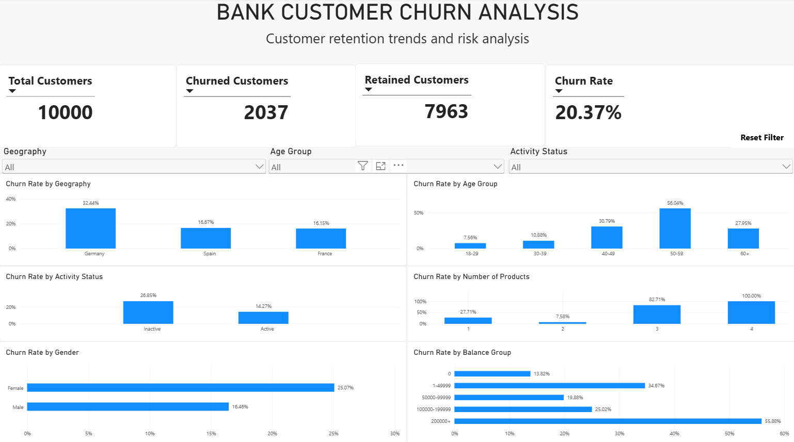

# Bank Customer Churn Analysis

## Project Overview

This project analyzes customer churn for a retail bank using PostgreSQL, SQL, and Power BI.

The goal was to identify customer segments with higher churn rates, understand patterns associated with customer attrition, and present the findings through an interactive Power BI dashboard.

The project follows an end-to-end analytics workflow:

**Raw CSV → PostgreSQL → Data Validation → SQL Analysis → Power BI → Business Insights**

---

## Business Problem

Customer churn directly affects customer retention and revenue.

The objective of this analysis was to answer questions such as:

- What is the overall customer churn rate?
- Which geographic regions have the highest churn?
- Which age groups are most likely to leave?
- Does customer activity affect churn?
- Does the number of products owned relate to churn?
- Are there noticeable differences across gender or account balance groups?
- Which customer segments should the bank investigate for retention opportunities?

---

## Dataset

The dataset used in this project is the **Bank Customer Churn Dataset** from [Maven Analytics Data Playground](https://app.mavenanalytics.io/datasets?search=bank+customer+churn).

It contains 10,000 customer records with information such as geography, age, balance, number of products, activity status, and churn status.

Key fields include:

- Customer ID
- Credit Score
- Geography
- Gender
- Age
- Tenure
- Balance
- Number of Products
- Credit Card Status
- Active Member Status
- Estimated Salary
- Churn Status

The original dataset is available in the `Bank_Churn.csv`

The source data was already relatively clean, so the SQL preparation stage focused mainly on **data validation and analysis rather than extensive data cleaning**.

---

## Tools Used

- **PostgreSQL** — Database storage and SQL analysis
- **SQL** — Data validation, aggregation, segmentation, and churn analysis
- **Power BI** — Data modeling, dashboard development, and visualization
- **Power Query** — Data preparation and creation of analytical categories
- **DAX** — KPI and churn-related measures
- **VS Code / SQLTools** — SQL development environment

---

## Project Workflow

### 1. Data Import

The original CSV file was imported into PostgreSQL as a staging table:

`stg_bank_churn`

A separate analysis-ready table was then created:

`clean_bank_churn`

The dataset did not require significant cleaning, so the staging data was retained while validation checks were performed before analysis.

---

### 2. Data Validation

SQL was used to check the reliability of the dataset before performing analysis.

Validation included:

- Checking total record count
- Checking duplicate Customer IDs
- Checking NULL values
- Reviewing categorical values
- Verifying customer and churn counts
- Checking data consistency across important columns

The SQL queries used for validation and analysis are available in:

`data_quality.sql`

---

### 3. SQL Analysis

SQL was used to calculate churn rates and analyze customers across different segments, including:

- Geography
- Age groups
- Gender
- Customer activity status
- Number of products
- Account balance groups

The overall churn rate identified in the dataset was:

**20.37%**

Out of **10,000 customers**, **2,037 customers churned** while **7,963 customers were retained**.

---

## Power BI Development

The validated dataset was imported into Power BI for further analysis and dashboard development.

### Power Query

Additional analytical columns were created, including:

- Churn Status
- Activity Status
- Credit Card Status
- Age Group
- Balance Group

### DAX Measures

Key measures included:

- Total Customers
- Churned Customers
- Retained Customers
- Churn Rate

These measures were used throughout the dashboard to make the visuals interactive and consistent.

---

## Dashboard



The dashboard includes:

- Total Customers
- Churned Customers
- Retained Customers
- Overall Churn Rate
- Churn Rate by Geography
- Churn Rate by Age Group
- Churn Rate by Activity Status
- Churn Rate by Number of Products
- Churn Rate by Gender
- Churn Rate by Balance Group
- Interactive slicers
- Reset Filters button using Power BI bookmarks

### Power BI File

Download the interactive Power BI dashboard here: [`Bank_Customer_Churn.pbix`](Bank_Customer_Churn.pbix)

---

## Key Insights

### Geography

Germany recorded the highest churn rate at approximately **32.44%**, compared with France and Spain at roughly **16%**.

This indicates that customers in Germany may require additional investigation from a retention perspective.

### Age

Customers aged **50–59** showed the highest churn rate at approximately **56.04%**.

Customers aged **40–49** also displayed relatively high churn.

This suggests that churn risk varies significantly across age segments.

### Customer Activity

Inactive customers showed a substantially higher churn rate than active customers.

Approximately:

- **Inactive customers:** 26.85%
- **Active customers:** 14.27%

Customer engagement therefore appears to be an important churn indicator.

### Gender

Female customers recorded a churn rate of approximately **25.07%**, compared with **16.46%** for male customers.

This represents a noticeable difference between the two customer segments and may warrant further investigation.

### Number of Products

Customers with **2 products** showed relatively low churn, while customers with **3 or 4 products** displayed considerably higher churn rates.

The 4-product segment showed extremely high churn; however, segment size should also be considered before drawing strong conclusions.

### Account Balance

Customers in the highest balance group showed elevated churn, including a churn rate of approximately **55.88%** for customers with balances above 200,000.

Because extreme balance groups may contain fewer customers, customer counts should be considered alongside churn percentages.

---

## Business Recommendations

Based on the analysis, the bank could consider:

- Investigating the high churn rate among customers in Germany
- Prioritizing retention analysis for customers aged 50–59
- Developing engagement strategies for inactive customers
- Investigating why customers with 3–4 products show unusually high churn
- Reviewing the experience of high-balance customers
- Conducting deeper analysis before targeting demographic groups such as gender

These variables should be treated as **churn indicators rather than direct causes of churn**.

Further behavioral and transactional data would be needed to determine the underlying reasons customers leave.

---

## Project Structure

```text
bank-customer-churn-analysis/
│
├── Bank_Churn.csv
├── data_quality.sql
├── dashboard.png
├── Bank_Customer_Churn.pbix
└── README.md
